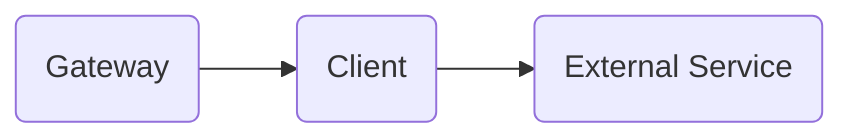
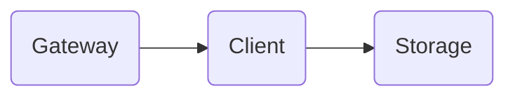
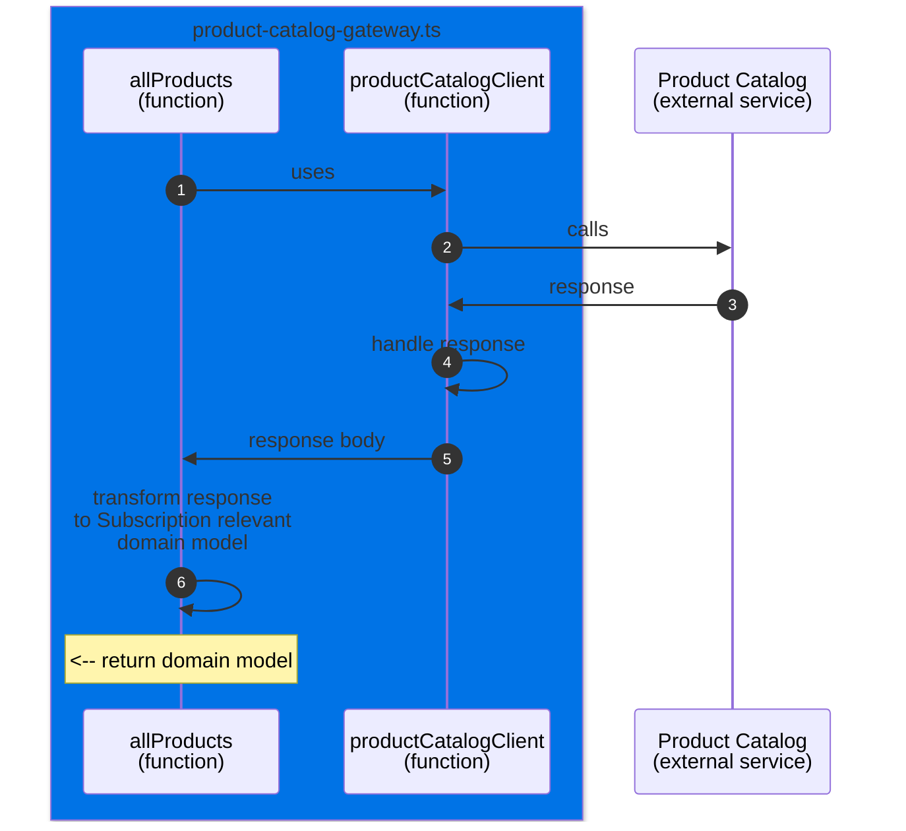

```mermaid
flowchart LR
    subgraph app [Subscription app]
        subgraph gateway [subscription-db.ts]
            findActiveByUserId("findActiveByUserId(userId)<br/><em>(function)</em><br/><strong>(A)</strong>") -->|uses| db("db()<br/><em>(function)</em><br/><strong>(B)</strong>")
        end
    end
    db -->|calls| server("SQLite<br/><em>(Storage)</em><br/><strong>(C)")

style app fill:#333333,stroke:#FFFFFF,stroke-width:2px
style gateway fill:#53AFDC,stroke:#FFFFFF,stroke-width:1px
```

# Drafts

## Application architecture

- Principles
  - Domain-focused
  - Appropriate coupling
- Main resource
  - Hexagonal architecure
- Secondary resources
  - Onion architecture
  - Clean architecture

Application architecture evolves alongside the application. When you structure
it around the problems it addresses, the organization and naming will clearly
reflect those issues. This alignment helps the architecture evolve purposefully.

### Communication with external service

#### Architecture

Communicating with an external service uses the [gateway][gateway] pattern, that gives us a
place to handle and transform the data to something that is relevant to the
Subscription application.

The implementation here is done with:

```mermaid
flowchart LR
    subgraph app [Subscription app]
        subgraph gateway [product-catalog-gateway.ts]
            allProducts("allProducts()<br/><em>(function)</em><br/><strong>(A)</strong>") -->|uses| productCatalogClient("productCatalogClient()<br/><em>(function)</em><br/><strong>(B)</strong>")
        end
    end
    productCatalogClient -->|calls| server("Product Catalog<br/><em>(External Service)</em><br/><strong>(C)")

style app fill:#333333,stroke:#FFFFFF,stroke-width:2px
style gateway fill:#53AFDC,stroke:#FFFFFF,stroke-width:1px
```

The pattern allows for separation of concerns by having each step of the process
contained in one place while enabling the composition of them to satisfy the
behaviour.

- **`A`**: responsible for transforming the external service definition to a
  Subscription specific representation (the domain model).
- **`B`**: responsible for the communication with the external service.
- **`C`**: the external dependency.

### Communication with storage

Communicating with a storage system uses the [gateway][gateway] pattern in a
way.

> [!NOTE]
> The [repository][repository] pattern is a common addition when integrating
> with storage systems as there are many known operations and plumbling that can
> be abstracted.

The implementation here is done with:

- **`A`**: responsible for transforming the external service definition to a
  Subscription specific representation.
- **`B`**: responsible for the communication with the external service.
- **`C`**: the external dependency.

### Others

[gateway]: https://martinfowler.com/articles/gateway-pattern.html
[repository]: https://martinfowler.com/eaaCatalog/repository.html
