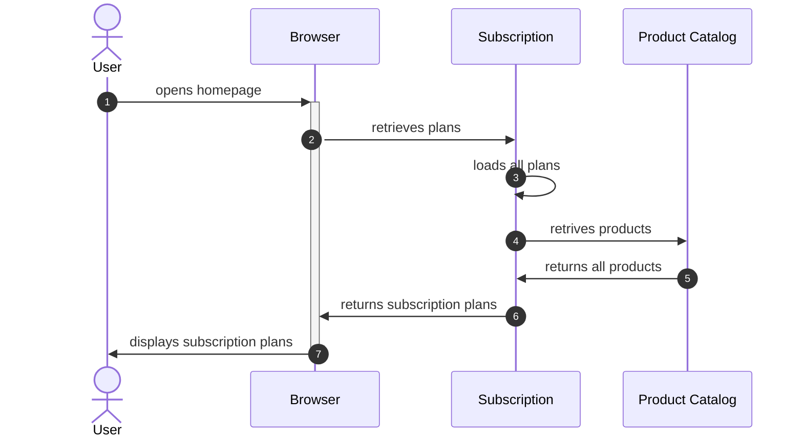
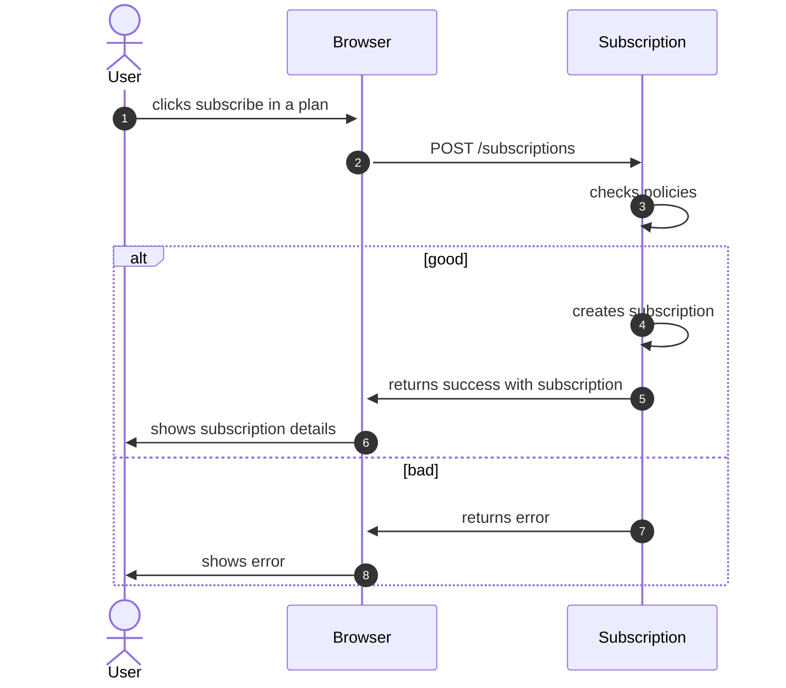

# Flows

## Subscription

### 1 Show plans

```mermaid
sequenceDiagram
    autonumber
    actor user as User
    participant browser as Browser
    participant subs as Subscription
    participant product_catalog as Product Catalog

    user ->>+ browser: opens homepage
    browser ->> subs: retrieves plans
    subs ->> subs: loads all plans
    subs ->> product_catalog: retrives products
    product_catalog ->> subs: returns all products
    subs ->> browser: returns subscription plans
    browser ->>- user: displays subscription plans
```

### 2 Creates subscription

```mermaid
sequenceDiagram
    autonumber
    actor user as User
    participant browser as Browser
    participant subs as Subscription

    user ->>+ browser: clicks subscribe in a plan
    browser ->> subs: POST /subscriptions
    subs ->> subs: checks policies
    alt good
    subs ->> subs: creates subscription
    subs ->> browser: returns success with subscription
    browser ->> user: shows subscription details
    else bad
    subs ->> browser: returns error
    browser ->> user: shows error
    end
```

### 3 Cancels active and non-cancelled subscription
