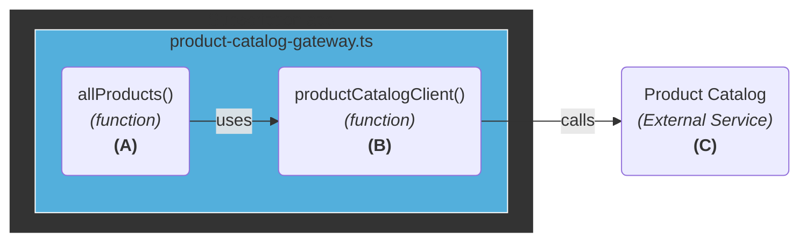
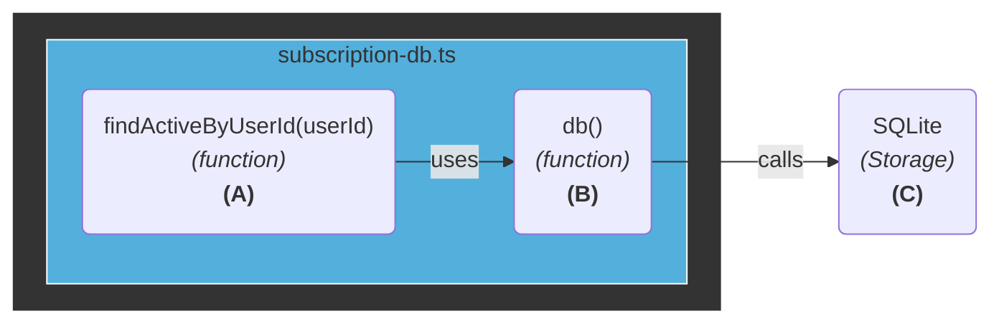

# Structure

## Communication with external services

```mermaid
flowchart LR
    subgraph app [Subscription app]
        subgraph gateway [product-catalog-gateway.ts]
            allProducts("allProducts()<br/><em>(function)</em><br/><strong>(A)</strong>") -->|uses| productCatalogClient("productCatalogClient()<br/><em>(function)</em><br/><strong>(B)</strong>")
        end
    end
    productCatalogClient -->|calls| server("Product Catalog<br/><em>(External Service)</em><br/><strong>(C)")

style app fill:#333333,stroke:#FFFFFF,stroke-width:2px
style gateway fill:#53AFDC,stroke:#FFFFFF,stroke-width:1px
```

## Communication with storage systems

```mermaid
flowchart LR
    subgraph app [Subscription app]
        subgraph gateway [subscription-db.ts]
            findActiveByUserId("findActiveByUserId(userId)<br/><em>(function)</em><br/><strong>(A)</strong>") -->|uses| db("db()<br/><em>(function)</em><br/><strong>(B)</strong>")
        end
    end
    db -->|calls| server("SQLite<br/><em>(Storage)</em><br/><strong>(C)")

style app fill:#333333,stroke:#FFFFFF,stroke-width:2px
style gateway fill:#53AFDC,stroke:#FFFFFF,stroke-width:1px
```
